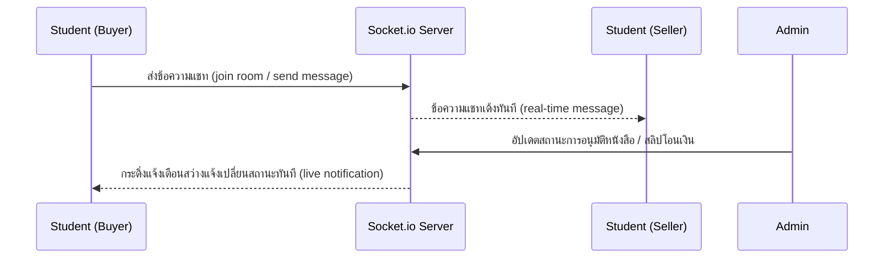

# Book University 📚
เว็บแอปพลิเคชันซื้อขายแลกเปลี่ยนหนังสือในมหาวิทยาลัย (University Book Marketplace) พัฒนาด้วยระบบ Full Stack JavaScript ครบวงจร พร้อมระบบแชทแบบ Real-time และระบบอนุมัติการตรวจสอบความปลอดภัยโดยผู้ดูแลระบบ (Admin Control Panel)

---

## ⚡ Tech Stack & Badges
[](https://react.dev/)
[](https://vite.dev/)
[](https://nodejs.org/)
[](https://expressjs.com/)
[](https://www.mysql.com/)
[](https://socket.io/)
[](https://tailwindcss.com/)
[](https://jestjs.io/)

---

## 📌 สารบัญ (Table of Contents)
1. [🔗 ลิงก์ทดลองใช้งาน & บัญชีทดสอบ (Live Demo & Test Accounts)](#-ลิงก์ทดลองใช้งาน--บัญชีทดสอบ-live-demo--test-accounts)
2. [🖼️ ภาพรวมและ Demo (Overview & Demo)](#️-ภาพรวมและ-demo-overview--demo)
3. [✨ ฟีเจอร์หลัก (Key Features)](#-ฟีเจอร์หลัก-key-features)
4. [🛠️ เทคโนโลยีที่ใช้ (Tech Stack)](#️-เทคโนโลยีที่ใช้-tech-stack)
5. [📂 โครงสร้างโปรเจกต์ (Folder Structure)](#-โครงสร้างโปรเจกต์-folder-structure)
6. [⚙️ วิธีการติดตั้งและใช้งาน (Installation & Setup)](#️-วิธีการติดตั้งและใช้งาน-installation--setup)
7. [🧪 การรันชุดทดสอบ (Automated Testing)](#-การรันชุดทดสอบ-automated-testing)
8. [🛣️ โครงสร้าง API Endpoints (API Reference)](#️-โครงสร้าง-api-endpoints-api-reference)
9. [💬 ระบบแชทและการทำงานแบบ Real-time](#-ระบบแชทและการทำงานแบบ-real-time)

---

## 🔗 ลิงก์ทดลองใช้งาน & บัญชีทดสอบ (Live Demo & Test Accounts)

เพื่อความสะดวกในการตรวจและทดสอบระบบ คุณสามารถทดลองใช้งานแอปพลิเคชันเวอร์ชันที่อัปโหลดขึ้นเซิร์ฟเวอร์ออนไลน์ได้ทันทีโดยไม่ต้อง Setup ฐานข้อมูลลงบนเครื่องโลคอล:

* 🌐 **เว็บไซต์หลัก (Frontend):** [https://book-university-frontend.vercel.app](https://your-vercel-domain-here.vercel.app) *(เปลี่ยนเป็น URL หน้าเว็บจริงของคุณ)*
* 🖥️ **เซิร์ฟเวอร์หลังบ้าน (Backend API):** [https://book-university-backend.railway.app](https://your-railway-domain-here.railway.app) *(เปลี่ยนเป็น URL หลังบ้านจริงของคุณ)*

### 🔑 บัญชีผู้ใช้งานสำหรับทดลองระบบ (Demo Credentials)

สามารถใช้บัญชีทดสอบเหล่านี้ในการเข้าสู่ระบบเพื่อลองฟังก์ชันการใช้งานต่างๆ ทั้งระบบซื้อขาย, แชทคุยสด และระบบอนุมัติของแอดมิน:

| บทบาท (Role) | อีเมล (Email) / รหัสประจำตัว | รหัสผ่าน (Password) | ฟังก์ชันที่แนะนำให้ทดสอบ |
| :--- | :--- | :--- | :--- |
| **ผู้ใช้งานทั่วไป (Student / User)** | `student@mail.com` | `xxx123` *(หรือรหัสผ่านทดสอบของคุณ)* | ดูหนังสือ, เพิ่มใส่ตะกร้า, สั่งซื้อ, อัปโหลดสลิป, แชทแบบเรียลไทม์ |
| **ผู้ดูแลระบบ (Admin)** | `admin@mail.com` | `xxx123` *(หรือรหัสผ่านทดสอบของคุณ)* | อนุมัติหนังสือเล่มใหม่, ตรวจสอบภาพสลิป และอนุมัติ/ยกเลิกยอดเงิน |

> ⚠️ **ข้อควรระวังเพื่อความปลอดภัย:**
> * **ห้าม** นำรหัสผ่านจริงของบัญชีส่วนตัว หรือคีย์ความปลอดภัยที่เป็นความลับในไฟล์ `.env` จริง (เช่น รหัสผ่านฐานข้อมูล MySQL, คีย์ JWT Secret จริง) มาแปะในคลังโค้ดนี้เด็ดขาด
> * ข้อมูลบัญชีที่ระบุในตารางด้านบนควรเป็น **บัญชี Demo** ที่เตรียมไว้ในฐานข้อมูล Production เพื่อการสาธิตเท่านั้น


## 🖼️ ภาพรวมและ Demo (Overview & Demo)

**Book University** พัฒนาขึ้นมาเพื่อแก้ปัญหาค่าใช้จ่ายด้านตำราเรียนของนักศึกษา โดยเป็นสื่อกลางในการเชื่อมโยงนักศึกษาภายในมหาวิทยาลัยให้สามารถซื้อ-ขาย หรือแลกเปลี่ยนตำราเรียนมือสองกันได้โดยตรง สะดวกรวดเร็ว และปลอดภัยผ่านการตรวจสอบของแอดมิน

### 📸 ภาพตัวอย่างการใช้งานระบบ (Screenshots & Demos)

| **หน้าแรก & การโปรโมต (Student Portal)** | **ระบบนัดรับสินค้า (Delivery & Pickup)** |
|:---:|:---:|
|  |  |
| แหล่งรวมหนังสือเรียนแยกตามหมวดหมู่และวิชา | ขั้นตอนรับหนังสือ/เช็คของและนัดรับที่สะดวก |

| **หน้าแอดมินตรวจสอบระบบ (Admin Dashboard)** | **โปรโมชั่นและกิจกรรม (University Promote)** |
|:---:|:---:|
|  |  |
| จัดการอนุมัติสลิปโอนเงินและตรวจสอบความถูกต้องของสติกเกอร์/หนังสือ | หน้าแบนเนอร์ประชาสัมพันธ์ภายในมหาวิทยาลัย |

> 💡 **คำแนะนำเพิ่มเติมสำหรับการแปะ Demo:** คุณสามารถนำไฟล์บันทึกหน้าจอ (.mp4 หรือ .gif) มาอัปโหลดไว้ในโปรเจกต์นี้ หรือแปลงวิดีโอเป็น GIF แล้วนำมาแปะแทนเพื่อแสดงระบบแชทแบบ Real-time และระบบแจ้งเตือนแบบสดได้ทันที!

---

## ✨ ฟีเจอร์หลัก (Key Features)

### 👤 สำหรับผู้ใช้งานทั่วไป (Student / User)
*   **ระบบสมาชิกและการรักษาความปลอดภัย (Authentication):**
    *   สมัครสมาชิกด้วยรหัสนักศึกษาและอีเมลของมหาวิทยาลัย
    *   เข้าสู่ระบบอย่างปลอดภัยโดยใช้รหัสผ่านที่เข้ารหัสด้วย **Bcryptjs** และตรวจสอบสิทธิ์ผ่าน **JWT (JSON Web Token)**
*   **การจัดการโปรไฟล์ (Profile Management):** อัปเดตข้อมูลการติดต่อ ข้อมูลส่วนตัว และช่องทางการรับเงิน/ส่งของ
*   **ระบบตลาดซื้อขายตำราเรียน (Marketplace Operations):**
    *   **ค้นหาแบบอัจฉริยะ (Search & Filter):** ค้นหาหนังสือผ่านชื่อเรื่อง รหัสวิชา หรือคณะที่เรียน
    *   **รายละเอียดหนังสือ (Book Details):** แสดงรูปภาพหนังสือ สภาพ ราคา และข้อมูลการติดต่อผู้ขายอย่างครบถ้วน
    *   **ตะกร้าสินค้า (Shopping Cart):** เพิ่ม/ลบ และสรุปราคารวมก่อนสั่งซื้อ
    *   **การสั่งซื้อ (Checkout Process):** เลือกวิธีรับของได้หลากหลาย ทั้งแบบนัดรับภายในมหาวิทยาลัย (Pickup) หรือจัดส่งพัสดุ (Delivery)
    *   **การลงขาย (Add/Update Book):** ผู้ใช้อัปโหลดรูปภาพหนังสือ กำหนดราคา และรายละเอียดหนังสือผ่านระบบอัปโหลดรูปภาพ
*   **ระบบแจ้งยอดและแนบหลักฐาน (Payment Upload):** อัปโหลดภาพสลิปโอนเงินพร้อมบันทึกวันเวลา เพื่อส่งให้แอดมินตรวจสอบความถูกต้อง
*   **ระบบแชท Real-time (Chat System):** แชทสอบถามข้อมูล นัดรับ หรือพูดคุยตกลงราคาผ่าน WebSockets แบบเรียลไทม์
*   **การแจ้งเตือนทันที (Live Notifications):** กระดิ่งแจ้งเตือนสว่างขึ้นเมื่อสถานะหนังสือหรือสลิปการโอนได้รับการอัปเดตจากแอดมิน

### 🛡️ สำหรับผู้ดูแลระบบ (Admin)
*   **Dashboard สรุปผล:** แสดงข้อมูลสถิติยอดสั่งซื้อ สมาชิก และรายการหนังสือแบบ Real-time
*   **อนุมัติหนังสือลงขาย (Verify Book Listings):** ตรวจสอบความเหมาะสมและข้อมูลของหนังสือที่ลงขายใหม่เพื่อป้องกัน Spam ก่อนอนุญาตให้ขึ้นแสดงบนแพลตฟอร์ม
*   **ตรวจสอบและอนุมัติสลิปโอนเงิน (Verify Payments):** ตรวจสลิปโอนเงินของคำสั่งซื้อเพื่ออนุมัติจัดส่ง (Completed) หรือปฏิเสธ (Not Approved)
*   **การเพิ่มแอดมิน (Admin Provisioning):** ลงทะเบียนเพื่อเพิ่มสิทธิ์ให้ทีมผู้ดูแลระบบคนอื่นเข้ามาช่วยจัดการข้อมูลได้

---

## 🛠️ เทคโนโลยีที่ใช้ (Tech Stack)

### 💻 Frontend (Client)
*   **Library:** React 19 (Functional Components & Hooks)
*   **Build Tool:** Vite 6 (รวดเร็วในการบิวด์และพัฒนา)
*   **Styling:** Tailwind CSS v4 + DaisyUI v5 (สไตล์โมเดิร์น สวยงามสไตล์ Glassmorphism และรองรับ Responsive Design)
*   **Routing:** React Router DOM v7 (จัดการการเปลี่ยนหน้าอย่างลื่นไหล)
*   **API Client:** Axios (เชื่อมต่อและรับส่งข้อมูล REST API)
*   **Real-time & UX:** Socket.io-client, React Hot Toast (แจ้งเตือนลอย), React Confirm Alert

### 🖥️ Backend (Server)
*   **Runtime:** Node.js
*   **Framework:** Express.js (v4)
*   **Database ORM:** Sequelize (v6) ร่วมกับไดรเวอร์ `mysql2` (Connection Pool)
*   **Security:** JSON Web Token (JWT) สำหรับระบุตัวตน และ bcryptjs สำหรับ Hash รหัสผ่าน
*   **File Storage:** Multer สำหรับรับไฟล์อัปโหลดและจัดเก็บภาพสลิปกับภาพหนังสือลงในเครื่องเซิร์ฟเวอร์
*   **Real-time Server:** Socket.io
*   **Testing:** Jest & Supertest สำหรับการทำ API Integration Testing

---

## 📂 โครงสร้างโปรเจกต์ (Folder Structure)

```text
Book_University/
├── client/                     # ส่วนของ Frontend (React App)
│   ├── src/
│   │   ├── assets/             # ไฟล์รูปภาพประกอบ, โลโก้ และ Font หลัก
│   │   ├── components/         # คอมโพเนนต์ส่วนกลาง (Navbar, Chat Window, Layouts)
│   │   ├── features/           # ฟังก์ชันการทำงานแยกตามโมดูล (เช่น books, auth)
│   │   ├── pages/              # หน้าหลักของแอปพลิเคชัน
│   │   │   ├── admin/          # หน้าสำหรับฝั่งแอดมิน (ตรวจสลิป, ตรวจหนังสือ, สมัครแอดมิน)
│   │   │   ├── user/           # หน้าสำหรับฝั่งผู้ใช้งาน (Home, Book Detail, Chat, Cart, Order)
│   │   │   ├── LoginPage.jsx   # หน้าลงชื่อเข้าใช้งาน
│   │   │   └── SignupPage.jsx  # หน้าลงทะเบียนผู้ใช้ใหม่
│   │   ├── util/               # ฟังก์ชันการเชื่อมต่อ API (Axios instance และ Socket socket)
│   │   ├── main.jsx            # Entry point แรกของ React
│   │   └── index.css           # สไตล์หลักระดับแอปและการนำเข้า Tailwind v4
│   ├── vite.config.js          # ไฟล์คอนฟิกของ Vite
│   └── package.json            # รายการ Dependencies และ Scripts ของ Frontend
│
├── server/                     # ส่วนของ Backend (Express API)
│   ├── src/
│   │   ├── config/             # การตั้งค่าระบบเชื่อมต่อฐานข้อมูล
│   │   │   ├── DB.config.js    # กำหนด Connection Pool ของ MySQL ด้วย Sequelize/MySQL2
│   │   │   ├── app.config.js   # ไฟล์เก็บค่า Config หลักของระบบ
│   │   │   └── book_university.sql # ไฟล์ Schema และข้อมูลตั้งต้นของฐานข้อมูล
│   │   ├── controllers/        # ประมวลผล Logic และคำสั่ง SQL ผ่าน Sequelize
│   │   ├── middleware/         # มิดเดิลแวร์คัดกรองคำขอ (JWT Verification, Multer Uploads)
│   │   ├── routes/             # กำหนดเส้นทาง (Endpoints) ของ API
│   │   ├── services/           # ฟังก์ชันสืบค้นฐานข้อมูลติดต่อกับ Sequelize Models
│   │   ├── socket/             # ควบคุม Event ของ WebSockets (Real-time Chat & Notifications)
│   │   ├── app.js              # ตัวสร้างและตั้งค่า Express App
│   │   └── index.js            # Entry point เริ่มต้นรันเซิร์ฟเวอร์
│   ├── tests/                  # โฟลเดอร์เก็บโค้ดทดสอบ (Jest & Supertest)
│   ├── uploads/                # โฟลเดอร์จัดเก็บภาพที่ผู้ใช้งานอัปโหลดเข้ามาจริง
│   ├── package.json            # รายการ Dependencies และ Scripts ของ Backend
│   └── TESTS.md                # คู่มือสอนเขียนและรันชุดทดสอบระบบหลังบ้าน
│
└── README.md                   # เอกสารประกอบโครงการหลัก
```

---

## ⚙️ วิธีการติดตั้งและใช้งาน (Installation & Setup)

### 1. โคลนคลังโค้ด (Clone Project)
```bash
git clone https://github.com/EqrthX/Book_University.git
cd Book_University
```

### 2. ตั้งค่าระบบฐานข้อมูล (Database Setup)
1. ติดตั้ง **MySQL Server** ในเครื่อง หรือใช้งานผ่าน Docker / Cloud Database (เช่น Aiven, PlanetScale)
2. สร้าง Database เปล่าขึ้นมาใน MySQL ของคุณ:
   ```sql
   CREATE DATABASE book_university;
   ```
3. นำเข้าข้อมูลและตารางเริ่มต้นโดยใช้คำสั่งด้านล่าง หรือ Import ไฟล์ผ่านเครื่องมือเช่น **phpMyAdmin**, **DBeaver**, หรือ **HeidiSQL**:
   * นำเข้าไฟล์จาก: `server/src/config/book_university.sql`

### 3. ตั้งค่าระบบหลังบ้าน (Backend Server Setup)
1. เปิด Terminal แล้วเข้าไปยังโฟลเดอร์ `server`:
   ```bash
   cd server
   ```
2. ติดตั้ง Node Packages ทั้งหมด:
   ```bash
   npm install
   ```
3. สร้างไฟล์ `.env` ในโฟลเดอร์ `server` และนำค่าคอนฟิกนี้ไปใส่ พร้อมระบุรหัสผ่านของคุณ:
   ```env
   PORT=5001
   DB_PORT=3306
   DB_HOST=localhost
   DB_USER=root
   DB_PASSWORD=ใส่รหัสผ่านฐานข้อมูลของคุณที่นี่
   DB_NAME=book_university
   JWT_SECRET=ใส่คีย์ลับของคุณสำหรับสร้างโทเค็นความปลอดภัย
   REACT_URL=http://localhost:5173
   ```
4. เริ่มรันระบบเซิร์ฟเวอร์หลังบ้านในโหมดพัฒนา:
   ```bash
   npm run dev
   # เซิร์ฟเวอร์จะเริ่มทำงานที่ http://localhost:5001
   ```

### 4. ตั้งค่าระบบหน้าบ้าน (Frontend Client Setup)
1. เปิด Terminal อีกหนึ่งหน้าต่าง แล้วเข้าไปยังโฟลเดอร์ `client`:
   ```bash
   cd ../client
   ```
2. ติดตั้ง Node Packages ทั้งหมด:
   ```bash
   npm install
   ```
3. สร้างไฟล์ `.env` ในโฟลเดอร์ `client` และระบุลิงก์ปลายทางของ API:
   ```env
   VITE_URL_SERVER=http://localhost:5001/api
   ```
4. เริ่มรันระบบหน้าบ้านในโหมดพัฒนา:
   ```bash
   npm run dev
   # เว็บไซต์จะเปิดทำงานและเข้าถึงได้จากบราวเซอร์ที่ http://localhost:5173
   ```

---

## 🧪 การรันชุดทดสอบ (Automated Testing)

โปรเจกต์นี้รองรับการทำ **Automated Integration Testing** สำหรับระบบหลังบ้านเพื่อตรวจสอบความถูกต้องของ API ในส่วนของการตรวจสอบความถูกต้องสิทธิ์การเข้าถึง, ตะกร้าสินค้า และหน้าแรก

*   **รันการทดสอบทั้งหมด (Run Jest):**
    ```bash
    cd server
    npm run test
    ```
*   **รันการทดสอบพร้อมดู Test Coverage:**
    ```bash
    cd server
    npm run test:coverage
    ```
    *หลังจากคำสั่งรันเสร็จสิ้น คุณสามารถเปิดดู HTML Report แบบละเอียดได้ที่ `server/coverage/lcov-report/index.html`*

สามารถอ่านคำแนะนำในการเขียนและรันชุดทดสอบเพิ่มเติมได้ที่ 📄 [TESTS.md](file:///c:/Users/Nontprawitch/Desktop/Vs%20code/Javascript/Book_University/server/TESTS.md)

---

## 🛣️ โครงสร้าง API Endpoints (API Reference)

| Method | Endpoint | Description (รายละเอียดการใช้งาน) | Auth Required |
|:---:|---|---|:---:|
| **POST** | `/api/auth/register` | ลงทะเบียนบัญชีสมาชิกใหม่สำหรับนักศึกษา | ❌ |
| **POST** | `/api/auth/login` | ตรวจสอบข้อมูลรหัสเพื่อรับ JWT Token เข้าระบบ | ❌ |
| **GET** | `/api/homepage` | ดึงหนังสือแนะนำและหมวดหมู่สำหรับแสดงหน้าแรก | ❌ |
| **GET** | `/api/product` | ดึงข้อมูลหนังสือที่ผ่านการอนุมัติและวางขายอยู่ทั้งหมด | ❌ |
| **POST** | `/api/product` | ส่งคำขอลงขายหนังสือใหม่ (รอแอดมินอนุมัติ) | ✔️ |
| **PUT** | `/api/product/:id` | แก้ไขข้อมูลรูปภาพและเนื้อหารายละเอียดหนังสือ | ✔️ |
| **DELETE**| `/api/product/:id` | ลบหนังสือเล่มดังกล่าวออกจากระบบฐานข้อมูล | ✔️ |
| **GET** | `/api/cart` | แสดงรายการหนังสือในตะกร้าปัจจุบันของผู้ใช้งาน | ✔️ |
| **POST** | `/api/cart` | เพิ่มหนังสือเข้าตะกร้าสินค้า | ✔️ |
| **DELETE**| `/api/cart/:id` | นำหนังสือออกจากตะกร้าสินค้า | ✔️ |
| **POST** | `/api/payment` | สร้างใบคำสั่งซื้อและยอดชำระเงิน | ✔️ |
| **PUT** | `/api/payment` | อัปโหลดหลักฐานสลิปและระบุวันเวลาโอนเงิน | ✔️ |
| **GET** | `/api/messages/:roomId`| ดึงประวัติการแชทระหว่างคู่สนทนาในห้องนั้นๆ | ✔️ |
| **GET** | `/api/notifications` | เรียกดูประวัติแจ้งเตือนเกี่ยวกับกิจกรรมของผู้ใช้ | ✔️ |
| **GET** | `/api/admin/books` | เรียกดูหนังสือใหม่ทั้งหมดที่ยังไม่อนุมัติ (แอดมินเท่านั้น) | ✔️ Admin |
| **PUT** | `/api/admin/books/:id` | อนุมัติหนังสือให้แสดงผลบนหน้าตลาดแอป | ✔️ Admin |
| **GET** | `/api/admin/payments`| ดึงรายการคำสั่งซื้อพร้อมรูปสลิปเพื่อตรวจสอบเงิน | ✔️ Admin |
| **PUT** | `/api/admin/order-status`| กดยืนยัน (Completed) หรือปฏิเสธรายการโอนเงิน | ✔️ Admin |

---

## 💬 ระบบแชทและการทำงานแบบ Real-time

เพื่อให้การซื้อขายเป็นไปได้อย่างรวดเร็ว ระบบจึงใช้ **Socket.io** เข้ามาเสริมการทำงานดังนี้:



1. **ระบบข้อความทันที (Instant Chat):** เมื่อเปิดหน้าแชท ระบบจะทำการเชื่อมโยงห้องแชท (Room) ระหว่างผู้ซื้อและผู้ขายผ่าน ID การสั่งซื้อ ข้อความจะส่งหากันโดยไม่ต้องกดรีเฟรชหน้าจอ และบันทึกลงใน Database ตาราง `messages` ไปพร้อมๆ กัน
2. **ระบบการแจ้งเตือนสด (Live Notifications):** ทุกครั้งที่ผู้ใช้อัปเดตสลิป หรือแอดมินทำการอนุมัติคำสั่งซื้อ เซิร์ฟเวอร์จะทำการปล่อย Event ไปยังคู่สนทนาหรือผู้ใช้ปลายทางแบบสดๆ ทำให้ระบบมีความโต้ตอบสูงและน่าใช้งาน

---
พัฒนาโดยทีมงาน **Book University** (Nontprawitch, Chaianun, Chanidapha) 📚✨
