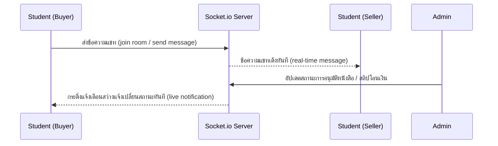

# Book University 📚
เว็บแอปพลิเคชันซื้อขายแลกเปลี่ยนหนังสือในมหาวิทยาลัย (University Book Marketplace) พัฒนาด้วยระบบ Full Stack JavaScript ครบวงจร พร้อมระบบแชทแบบ Real-time และระบบอนุมัติการตรวจสอบความปลอดภัยโดยผู้ดูแลระบบ (Admin Control Panel)

---

## ⚡ Tech Stack & Badges
[](https://react.dev/)
[](https://vite.dev/)
[](https://nodejs.org/)
[](https://expressjs.com/)
[](https://www.mysql.com/)
[](https://socket.io/)
[](https://tailwindcss.com/)
[](https://jestjs.io/)

---

## 📌 สารบัญ (Table of Contents)
1. [🔗 ลิงก์ทดลองใช้งาน & บัญชีทดสอบ (Live Demo & Test Accounts)](#-ลิงก์ทดลองใช้งาน--บัญชีทดสอบ-live-demo--test-accounts)
2. [📅 บันทึกการพัฒนา & Timeline การปรับปรุงระบบ (Development Timeline)](#-บันทึกการพัฒนา--timeline-การปรับปรุงระบบ-development-timeline)
3. [🖼️ ภาพรวมและ Demo (Overview & Demo)](#️-ภาพรวมและ-demo-overview--demo)
4. [✨ ฟีเจอร์หลัก (Key Features)](#-ฟีเจอร์หลัก-key-features)
5. [🛠️ เทคโนโลยีที่ใช้ (Tech Stack)](#️-เทคโนโลยีที่ใช้-tech-stack)
6. [📂 โครงสร้างโปรเจกต์ (Folder Structure)](#-โครงสร้างโปรเจกต์-folder-structure)
7. [⚙️ วิธีการติดตั้งและใช้งาน (Installation & Setup)](#️-วิธีการติดตั้งและใช้งาน-installation--setup)
8. [🧪 การรันชุดทดสอบ (Automated Testing)](#-การรันชุดทดสอบ-automated-testing)
9. [🛣️ โครงสร้าง API Endpoints (API Reference)](#️-โครงสร้าง-api-endpoints-api-reference)
10. [💬 ระบบแชทและการทำงานแบบ Real-time](#-ระบบแชทและการทำงานแบบ-real-time)

---

## 🔗 ลิงก์ทดลองใช้งาน & บัญชีทดสอบ (Live Demo & Test Accounts)

เพื่อความสะดวกในการตรวจและทดสอบระบบ คุณสามารถทดลองใช้งานแอปพลิเคชันเวอร์ชันที่อัปโหลดขึ้นเซิร์ฟเวอร์ออนไลน์ได้ทันทีโดยไม่ต้อง Setup ฐานข้อมูลลงบนเครื่องโลคอล:

* 🌐 **เว็บไซต์หลัก (Frontend):** [https://book-university-frontend.vercel.app](https://your-vercel-domain-here.vercel.app) *(เปลี่ยนเป็น URL หน้าเว็บจริงของคุณ)*
* 🖥️ **เซิร์ฟเวอร์หลังบ้าน (Backend API):** [https://book-university-backend.railway.app](https://your-railway-domain-here.railway.app) *(เปลี่ยนเป็น URL หลังบ้านจริงของคุณ)*

### 🔑 บัญชีผู้ใช้งานสำหรับทดลองระบบ (Demo Credentials)

สามารถใช้บัญชีทดสอบเหล่านี้ในการเข้าสู่ระบบเพื่อลองฟังก์ชันการใช้งานต่างๆ ทั้งระบบซื้อขาย, แชทคุยสด และระบบอนุมัติของแอดมิน:

| บทบาท (Role) | อีเมล (Email) / รหัสประจำตัว | รหัสผ่าน (Password) | ฟังก์ชันที่แนะนำให้ทดสอบ |
| :--- | :--- | :--- | :--- |
| **ผู้ใช้งานทั่วไป (Student / User)** | `student@mail.com` | `xxx123` *(หรือรหัสผ่านทดสอบของคุณ)* | ดูหนังสือ, เพิ่มใส่ตะกร้า, สั่งซื้อ, อัปโหลดสลิป, แชทแบบเรียลไทม์ |
| **ผู้ดูแลระบบ (Admin)** | `admin@mail.com` | `xxx123` *(หรือรหัสผ่านทดสอบของคุณ)* | อนุมัติหนังสือเล่มใหม่, ตรวจสอบภาพสลิป และอนุมัติ/ยกเลิกยอดเงิน |

> ⚠️ **ข้อควรระวังเพื่อความปลอดภัย:**
> * **ห้าม** นำรหัสผ่านจริงของบัญชีส่วนตัว หรือคีย์ความปลอดภัยที่เป็นความลับในไฟล์ `.env` จริง (เช่น รหัสผ่านฐานข้อมูล MySQL, คีย์ JWT Secret จริง) มาแปะในคลังโค้ดนี้เด็ดขาด
> * ข้อมูลบัญชีที่ระบุในตารางด้านบนควรเป็น **บัญชี Demo** ที่เตรียมไว้ในฐานข้อมูล Production เพื่อการสาธิตเท่านั้น

## 📅 บันทึกการพัฒนา & Timeline การปรับปรุงระบบ (Development Timeline)

เพื่อติดตามความก้าวหน้าในการพัฒนาแพลตฟอร์มในการทำงานร่วมกัน นี่คือประวัติการอัปเดตและพัฒนาชุดฟีเจอร์หลัก (Feature & Refactoring Timeline):

| เฟสการทำงาน (Sprint) | รายละเอียดการปรับปรุงระบบ (Key Features & Refactoring) | สถานะ (Status) | ไฟล์สำคัญที่เกี่ยวข้อง (Key Files) |
| :---: | :--- | :---: | :--- |
| **Sprint 1**<br>*(Sequelize ORM Migration)* | **ย้ายระบบการติดต่อฐานข้อมูลจาก SQL Raw Query เป็น Sequelize ORM:**<br>• ยกระดับโครงสร้างความปลอดภัยและการจัดการฐานข้อมูลโดยสร้างโมเดลความสัมพันธ์ (Associations Index)<br>• พัฒนาโมเดล `User`, `Book`, `Cart`, `Subject`, `Order`, `OrderItem`, `Payment`, `Message`, `Notification` ให้ทำงานผ่าน Sequelize ORM เต็มรูปแบบแทน Raw SQL | `Completed` | [models/index.js](file:///c:/Users/Nontprawitch/Desktop/Vs%20code/Javascript/Book_University/server/src/models/index.js)<br>[services/user.service.js](file:///c:/Users/Nontprawitch/Desktop/Vs%20code/Javascript/Book_University/server/src/services/user.service.js) |
| **Sprint 2**<br>*(Cart State Refactoring)* | **ย้ายระบบจัดการตะกร้าสินค้าไปเป็น Global State:**<br>• ออกแบบและสร้าง `CartContext` เพื่อรวบรวมฟังก์ชันการเพิ่ม/ลบสิ่งของ และเชื่อมต่อกับ Database ในจุดเดียว<br>• ส่งผลให้จำนวนเลขตะกร้าบนแถบ Navbar อัปเดตแบบเรียลไทม์ทันทีและลื่นไหลโดยไม่ต้องรีเฟรชหน้าจอหรือเรียกซ้ำซ้อน | `Completed` | [CartContext.jsx](file:///c:/Users/Nontprawitch/Desktop/Vs%20code/Javascript/Book_University/client/src/context/CartContext.jsx)<br>[Navbar.jsx](file:///c:/Users/Nontprawitch/Desktop/Vs%20code/Javascript/Book_University/client/src/components/layouts/Navbar.jsx) |
| **Sprint 3**<br>*(UI/UX Polishing)* | **ยกระดับ UI/UX และธีมสีให้ดูทันสมัยและน่าใช้งาน:**<br>• เพิ่มระบบสลับโหมดสว่าง-มืด (Light/Dark Mode Switcher) ด้วย DaisyUI<br>• เปลี่ยนไอคอนดาวน์โหลดธรรมดาในหน้าหลักเป็น **Skeleton Loader** เล่นเอฟเฟกต์แสงวิ่งสั่นไหว (Pulsating Effect) ขณะรอเชื่อมต่อ API ดึงข้อมูลหนังสือ<br>• ทำปุ่มกดแสดงสถานะกำลังโหลด (Loading State) ป้องกันการสแปมปุ่มสั่งซื้อ/ลงหนังสือซ้ำซ้อน | `Completed` | [HomePage.jsx](file:///c:/Users/Nontprawitch/Desktop/Vs%20code/Javascript/Book_University/client/src/pages/user/HomePage.jsx)<br>[AddBook.jsx](file:///c:/Users/Nontprawitch/Desktop/Vs%20code/Javascript/Book_University/client/src/pages/user/AddBook.jsx) |
| **Sprint 4**<br>*(Cloud Storage Integration)* | **ระบบคลาวด์จัดเก็บไฟล์ถาวร (Cloudinary Integration):**<br>• พัฒนาระบบจัดเก็บไฟล์รูปภาพตำราเรียน สลิปโอนเงิน และรูปแนบแชทจากเครื่อง Local Server ขึ้นสู่ระบบ Cloud Storage (Cloudinary)<br>• เปลี่ยน Multer จากการบันทึกชั่วคราวลงฮาร์ดดิสก์เซิร์ฟเวอร์ย้ายไปเก็บที่ Buffer ในแรมชั่วคราวแล้ว Stream ขึ้นคลาวด์ทันที ป้องกันภาพสูญหายเมื่อเครื่องรีสตาร์ท<br>• ทำโมดูล `getImageUrl` ซัพพอร์ตภาพทั้งระบบลิงก์สากลและรูปเดิมบน Disk | `Completed` | [cloudinary.config.js](file:///c:/Users/Nontprawitch/Desktop/Vs%20code/Javascript/Book_University/server/src/config/cloudinary.config.js)<br>[image.js](file:///c:/Users/Nontprawitch/Desktop/Vs%20code/Javascript/Book_University/client/src/util/image.js) |
| **Sprint 5**<br>*(Admin Dashboard & Activity Tracking)* | **ระบบควบคุมผู้ใช้งาน สถิติความเคลื่อนไหว และการจัดการสถานะสินค้า:**<br>• เพิ่มบันทึกการล็อกอิน (`loginCount`) และบันทึกเวลาความเคลื่อนไหวล่าสุด (`lastActiveAt`) อัปเดตเรียลไทม์ผ่าน Middleware<br>• พัฒนาหน้าจอ **[AdminUsers.jsx](file:///c:/Users/Nontprawitch/Desktop/Vs%20code/Javascript/Book_University/client/src/pages/admin/AdminUsers.jsx)** แสดงสถานะล็อกอิน, อัปเดตเปลี่ยนสิทธิ์ Admin/Student, และปุ่มลบแอดเคาท์ที่ปลอดภัย<br>• พัฒนาหน้าจอ **[AdminBooks.jsx](file:///c:/Users/Nontprawitch/Desktop/Vs%20code/Javascript/Book_University/client/src/pages/admin/AdminBooks.jsx)** สำหรับตรวจอนุมัติวางจำหน่ายหนังสือและสลับเปลี่ยนสถานะสินค้าว่ากำลังลงขายอยู่ หรือขายแล้ว (Sold Out) | `Completed` | [AdminUsers.jsx](file:///c:/Users/Nontprawitch/Desktop/Vs%20code/Javascript/Book_University/client/src/pages/admin/AdminUsers.jsx)<br>[AdminBooks.jsx](file:///c:/Users/Nontprawitch/Desktop/Vs%20code/Javascript/Book_University/client/src/pages/admin/AdminBooks.jsx) |
| **Sprint 6**<br>*(Seller Chat Linking, Real-time Status, Accessibility, OAuth 2.0 & AI Chatbot)* | **ระบบแชทตรงกับผู้ขาย, สถานะออนไลน์เรียลไทม์, ปรับขนาดฟอนต์ทุกหน้า, Google OAuth 2.0 & AI Chatbot:**<br>• เชื่อมโยงปุ่มกด "ส่งข้อความแชท" จากหน้ารายละเอียดหนังสือไปยังผู้ขายคนนั้นโดยตรงและเปิดห้องแชทให้อัตโนมัติ<br>• เพิ่มระบบ Socket broadcast แสดงจุดและข้อความสถานะ `กำลังใช้งาน (Online)` / `ออฟไลน์ (Offline)` เรียลไทม์<br>• ขยายขนาดตัวอักษรทุกหน้าในระบบจาก `text-xs` (12px) เป็น `text-sm` (14px) / `text-base` (16px) เพื่ออ่านง่ายสบายตา<br>• พัฒนาระบบยืนยันตัวตน Google OAuth 2.0 สมัครและเข้าสู่ระบบให้อัตโนมัติพร้อมออก JWT Session<br>• พัฒนาโครงสร้าง AI Chatbot Widget (Client FAB & Backend `/api/ai/chat`) พร้อมสแคฟโฟลด์ RAG/LLM | `Completed` | [oauth.route.js](file:///c:/Users/Nontprawitch/Desktop/Vs%20code/Javascript/Book_University/server/src/routes/oauth.route.js)<br>[AIChatModal.jsx](file:///c:/Users/Nontprawitch/Desktop/Vs%20code/Javascript/Book_University/client/src/components/user/AIChatModal.jsx)<br>[ai.controller.js](file:///c:/Users/Nontprawitch/Desktop/Vs%20code/Javascript/Book_University/server/src/controllers/ai.controller.js) |

## 🚀 บันทึกประวัติการอัปเดตระบบ (Daily Update Logs - Portfolio Highlights)

ส่วนนี้สรุปรายละเอียดการพัฒนาระบบและการแก้ปัญหาเชิงเทคนิคในแต่ละรอบการอัปเดต เพื่อใช้สำหรับอ้างอิงความก้าวหน้าและการนำไปประกอบเป็นผลงานใน **Portfolio**:

### 📅 อัปเดตล่าสุด: 1 กันยายน 2569 (2026-09-01)

ในรอบการพัฒนานี้ เน้นการปรับปรุงประสบการณ์ผู้ใช้งาน (UX/UI Enhancement), การเชื่อมโยงการสื่อสารระหว่างผู้ซื้อและผู้ขายอย่างไร้รอยต่อ, การเพิ่มสถานะการออนไลน์แบบเรียลไทม์ผ่าน Socket.io, การปรับปรุงขนาดตัวอักษรทุกหน้าในระบบเพื่อการอ่านง่ายสบายตา, การพัฒนาระบบยืนยันตัวตนผ่าน Google OAuth 2.0 สมบูรณ์แบบ, และการสร้างโครงสร้าง AI Chatbot Widget สำหรับการเรียนรู้และขยายผลในอนาคต:

#### 1. Seller Direct Chat Navigation (ระบบเชื่อมโยงห้องแชทหาผู้ขายโดยตรง)
*   **รายละเอียดฟีเจอร์:**
    *   ปรับปรุงปุ่มกด *"ส่งข้อความแชท"* ในหน้ารายละเอียดหนังสือ [DetailsPage.jsx](file:///c:/Users/Nontprawitch/Desktop/Vs%20code/Javascript/Book_University/client/src/pages/user/DetailsPage.jsx) ให้ส่ง `userId` ของผู้ขายผ่าน Query Parameter (`/user/Chat?userId=${book.userId}`)
    *   อัปเดตหน้า [ChatPage.jsx](file:///c:/Users/Nontprawitch/Desktop/Vs%20code/Javascript/Book_University/client/src/pages/user/ChatPage.jsx) ให้รับค่า `userId` อัตโนมัติ เลือกรายชื่อผู้ขายในกล่องข้อความ และโหลดประวัติการสนทนาขึ้นมาทันทีโดยไม่ต้องกดเลือกเอง
    *   ปรับปรุง API ฝั่งเซิร์ฟเวอร์ [messages.service.js](file:///c:/Users/Nontprawitch/Desktop/Vs%20code/Javascript/Book_University/server/src/services/messages.service.js) และ [messages.controller.js](file:///c:/Users/Nontprawitch/Desktop/Vs%20code/Javascript/Book_University/server/src/controllers/messages.controller.js) ให้รองรับ parameter `userId` เพื่อดึงผู้ใช้งานคนนั้นขึ้นมาแสดงในรายชื่อแม้ว่าจะอยู่นอกเขต Pagination Limit

#### 2. Real-time Active / Online Status Tracking (ระบบแสดงสถานะกำลังใช้งานเรียลไทม์)
*   **รายละเอียดฟีเจอร์:**
    *   อัปเดต [chat.socket.js](file:///c:/Users/Nontprawitch/Desktop/Vs%20code/Javascript/Book_University/server/src/socket/chat.socket.js) ให้กระจายข้อมูลผู้ใช้งานที่เชื่อมต่ออยู่ผ่าน Event `get_online_users` แบบเรียลไทม์เมื่อมีการเชื่อมต่อ (`register_user`) หรือตัดการเชื่อมต่อ (`disconnect`)
    *   เพิ่มการแสดงผลจุดสถานะสีเขียว 🟢 และข้อความ `🟢 กำลังใช้งาน` สำหรับผู้ใช้ออนไลน์ และจุดสีเทา ⚪ `⚪ ออฟไลน์` สำหรับผู้ใช้ออฟไลน์ ในแถบรายชื่อผู้ใช้ด้านซ้ายและแถบหัวข้อแชทด้านบน

#### 3. Full-App Typography & Form Accessibility Optimization (การปรับขนาดฟอนต์ทั่วทั้งระบบเพื่ออ่านง่ายสบายตา)
*   **รายละเอียดฟีเจอร์:**
    *   ยกระดับขนาดตัวอักษรทั่วทั้งแอปพลิเคชัน จากขนาดเล็ก `text-xs` (12px) ➡️ **`text-sm` (14px)**, **`text-base` (16px)**, และ **`text-lg`/`text-xl`** เพื่อลดอาการปวดสายตาและอ่านข้อมูลได้ชัดเจนยิ่งขึ้น
    *   ปรับปรุงส่วนประกอบหลัก: [BookCard.jsx](file:///c:/Users/Nontprawitch/Desktop/Vs%20code/Javascript/Book_University/client/src/features/books/components/BookCard.jsx), [Head.jsx](file:///c:/Users/Nontprawitch/Desktop/Vs%20code/Javascript/Book_University/client/src/components/user/Head.jsx), [SearchInput.jsx](file:///c:/Users/Nontprawitch/Desktop/Vs%20code/Javascript/Book_University/client/src/components/user/SearchInput.jsx), [index.css](file:///c:/Users/Nontprawitch/Desktop/Vs%20code/Javascript/Book_University/client/src/index.css)
    *   ปรับปรุงหน้าการใช้งานหลัก: [HomePage.jsx](file:///c:/Users/Nontprawitch/Desktop/Vs%20code/Javascript/Book_University/client/src/pages/user/HomePage.jsx), [DetailsPage.jsx](file:///c:/Users/Nontprawitch/Desktop/Vs%20code/Javascript/Book_University/client/src/pages/user/DetailsPage.jsx), [SearchPage.jsx](file:///c:/Users/Nontprawitch/Desktop/Vs%20code/Javascript/Book_University/client/src/pages/user/SearchPage.jsx), [BasketPage.jsx](file:///c:/Users/Nontprawitch/Desktop/Vs%20code/Javascript/Book_University/client/src/pages/user/BasketPage.jsx), [ProfilePage.jsx](file:///c:/Users/Nontprawitch/Desktop/Vs%20code/Javascript/Book_University/client/src/pages/user/ProfilePage.jsx), [BuyNowPage.jsx](file:///c:/Users/Nontprawitch/Desktop/Vs%20code/Javascript/Book_University/client/src/pages/user/BuyNowPage.jsx), [DeliveryPage.jsx](file:///c:/Users/Nontprawitch/Desktop/Vs%20code/Javascript/Book_University/client/src/pages/user/DeliveryPage.jsx), [NotificationPage.jsx](file:///c:/Users/Nontprawitch/Desktop/Vs%20code/Javascript/Book_University/client/src/pages/user/NotificationPage.jsx), [BuyHistoryPage.jsx](file:///c:/Users/Nontprawitch/Desktop/Vs%20code/Javascript/Book_University/client/src/pages/user/BuyHistoryPage.jsx), [SellHistoryPage.jsx](file:///c:/Users/Nontprawitch/Desktop/Vs%20code/Javascript/Book_University/client/src/pages/user/SellHistoryPage.jsx), [LoginPage.jsx](file:///c:/Users/Nontprawitch/Desktop/Vs%20code/Javascript/Book_University/client/src/pages/LoginPage.jsx), และ [SignupPage.jsx](file:///c:/Users/Nontprawitch/Desktop/Vs%20code/Javascript/Book_University/client/src/pages/SignupPage.jsx)

#### 4. Project History Footer & Team Credits (ส่วนท้ายเว็บและเกียรติประวัติโครงงาน)
*   **รายละเอียดฟีเจอร์:**
    *   สร้างคอมโพเนนต์ [Footer.jsx](file:///c:/Users/Nontprawitch/Desktop/Vs%20code/Javascript/Book_University/client/src/components/layouts/Footer.jsx) ติดตั้งลงใน [UserLayout.jsx](file:///c:/Users/Nontprawitch/Desktop/Vs%20code/Javascript/Book_University/client/src/components/layouts/UserLayout.jsx) เพื่อแสดงผลส่วนล่างสุดของทุกหน้าจอ
    *   ระบุประวัติว่าโครงงานนี้เป็น **Mini Project สมาชิก 3 คน** สำหรับวิชา **Software Engineering (SE)** มหาวิทยาลัยหอการค้าไทย (UTCC) โดยมีสมาชิกผู้จัดทำ ได้แก่ **Nontprawitch**, **Chanidapha**, และ **Chaianun**
    *   ระบุหมายเหตุการพัฒนาต่อว่า เนื่องจากภายหลังจบรายวิชาไม่มีผู้พัฒนาต่อ โครงสร้างและ UI ของระบบจึงได้รับการยกระดับและปรับปรุงด้วย **AI** เพื่อความสวยงาม ความสะดวกในการใช้งาน และความสมบูรณ์ของระบบ

#### 5. Full Google OAuth 2.0 Authentication & Auto-Signup (ระบบเข้าสู่ระบบและสมัครสมาชิกด้วย Google)
*   **รายละเอียดฟีเจอร์:**
    *   พัฒนาเอนด์พอยต์ [oauth.route.js](file:///c:/Users/Nontprawitch/Desktop/Vs%20code/Javascript/Book_University/server/src/routes/oauth.route.js) ฝั่งหลังบ้านสำหรับแลกเปลี่ยน Authorization Code กับ Google OAuth 2.0
    *   ตรวจสอบ ID Token ผ่าน `google-auth-library` (`client.verifyIdToken`) และดึง `googleId`, `email`, และ `fullName`
    *   สมัครสมาชิกให้อัตโนมัติหากเป็นผู้ใช้ใหม่ และล็อกอินเข้าสู่ระบบพร้อมสร้าง JWT Session Cookie ให้อัตโนมัติทันที

#### 6. AI Chatbot Scaffold & Floating Widget (สแคฟโฟลด์แชทบอทผู้ช่วยอัจฉริยะ)
*   **รายละเอียดฟีเจอร์:**
    *   สร้างปุ่มลอยและโมดอลแชท [AIChatModal.jsx](file:///c:/Users/Nontprawitch/Desktop/Vs%20code/Javascript/Book_University/client/src/components/user/AIChatModal.jsx) ลอยอยู่มุมขวาล่างของทุกหน้าเพจ พร้อมดีไซน์ Dark Glassmorphism, ชิปคำถามยอดฮิต, และอนิเมชันตอนพิมพ์
    *   สร้างคอนโทรลเลอร์หลังบ้าน [ai.controller.js](file:///c:/Users/Nontprawitch/Desktop/Vs%20code/Javascript/Book_University/server/src/controllers/ai.controller.js) และเราต์ `/api/ai/chat` พร้อมตัวอย่างโค้ด RAG / Gemini / OpenAI SDK ให้พร้อมสำหรับนำ AI/ML Model มาเสียบต่อในอนาคต

### 📅 อัปเดตก่อนหน้า: 28 สิงหาคม 2569 (2026-08-28)

ในรอบการพัฒนานี้ เน้นการยกระดับความน่าเชื่อถือ ความปลอดภัยในการบันทึกข้อมูลแบบถาวรบนระบบคลาวด์ การติดตามความเคลื่อนไหวของผู้ใช้งานสำหรับผู้ดูแลระบบ และการวางโครงสร้างระบบความปลอดภัยทางเลือก (OAuth 2.0) โดยมีหัวข้อผลงานทางเทคนิคที่ทำสำเร็จดังนี้:

#### 1. Cloud Persistent Storage Integration (ระบบจัดเก็บข้อมูลถาวรบนคลาวด์)
*   **ความท้าทาย:** การบันทึกไฟล์อิมเมจในเครื่องเซิร์ฟเวอร์แบบเดิม (Local Disk Storage) ทำให้ภาพสูญหายทุกครั้งเมื่อนำไปโฮสต์บนแพลตฟอร์มที่เป็น Cloud Hosting (เนื่องจากมีลักษณะเป็น Ephemeral File System ที่จะรีเซ็ตตัวเองทุกครั้งที่มีการอัปเดตโค้ดหรือรีสตาร์ทเซิร์ฟเวอร์)
*   **การแก้ไข (Tech Achievement):**
    *   ปรับปรุงมิดเดิลแวร์การรับไฟล์ของ [multer](file:///c:/Users/Nontprawitch/Desktop/Vs%20code/Javascript/Book_University/server/src/middleware/upload.middleware.js) จากการพักไฟล์ในเครื่องให้ทำงานในรูปแบบ **Memory Buffer Storage** แทน
    *   พัฒนาระบบ Stream Upload ผ่านชุดเครื่องมือ [cloudinary.config.js](file:///c:/Users/Nontprawitch/Desktop/Vs%20code/Javascript/Book_University/server/src/config/cloudinary.config.js) โดยดึงข้อมูลรูปภาพจากหน่วยความจำ (Buffer) และยิงขึ้นระบบ **Cloudinary API** แบบ Secure HTTPS โดยตรง
    *   เชื่อมต่อการอัปโหลดไฟล์รูปภาพใหม่บนคลาวด์ 3 ส่วนหลัก: รูปภาพปกหนังสือเรียน, รูปภาพสลิปใบโอนเงินสำหรับแจ้งชำระเงิน, และไฟล์รูปแนบแชทเรียลไทม์
    *   เขียนฟังก์ชันความช่วยเหลือ [image.js](file:///c:/Users/Nontprawitch/Desktop/Vs%20code/Javascript/Book_University/client/src/util/image.js) ฝั่งผู้ใช้งานเพื่อเช็คฟิลด์รูปภาพในฐานข้อมูลแบบยืดหยุ่น โดยสามารถแสดงผลได้ทั้งรูปภาพที่เป็นลิงก์ CDN ของ Cloudinary และรูปภาพในโหมด Legacy (ภาพในอดีตที่เก็บในโฟลเดอร์ฝั่งเซิร์ฟเวอร์เดิม)

#### 2. User Activity Tracking & Administration (ระบบติดตามความเคลื่อนไหวและจัดการผู้ใช้)
*   **รายละเอียดฟีเจอร์:**
    *   ดำเนินการคำสั่งปรับปรุงฐานข้อมูลเพิ่มฟิลด์ `loginCount` (จำนวนครั้งการเข้าระบบ), `lastActiveAt` (เวลาความเคลื่อนไหวล่าสุด), และ `googleId` ลงในตารางผู้ใช้งาน รวมถึงปรับแต่งโครงสร้าง `studentId` และ `password` ให้เป็น Nullable สำหรับเตรียมรองรับ Social Login
    *   ผูกการบันทึกจำนวนการล็อกอินสะสมในระบบตรวจสอบความถูกต้อง และสร้าง Middleware อัปเดตเวลา `lastActiveAt` ทุกครั้งที่ผู้ใช้ส่งคำขอเรียกใช้งาน API
    *   ออกแบบหน้าตารางการจัดการสมาชิกของแอดมิน [AdminUsers.jsx](file:///c:/Users/Nontprawitch/Desktop/Vs%20code/Javascript/Book_University/client/src/pages/admin/AdminUsers.jsx) ที่มีตัวระบุสเตตัส Active (ตอนนี้ / วันนี้ / ไม่ได้เคลือนไหว) ด้วยรูปแบบ CSS Animation Pulsating Dot สวยงาม พร้อมปุ่มเปลี่ยนบทบาทสิทธิ์สมาชิก และกล่องโมดอลแจ้งลบบัญชีผู้ใช้ออกอย่างปลอดภัย

#### 3. Book Status Catalog Manager (ระบบบริหารจัดการและติดตามสถานะหนังสือของ Admin)
*   **รายละเอียดฟีเจอร์:**
    *   พัฒนาหน้าจอตรวจสอบรายการหนังสือทั้งหมดของแพลตฟอร์ม [AdminBooks.jsx](file:///c:/Users/Nontprawitch/Desktop/Vs%20code/Javascript/Book_University/client/src/pages/admin/AdminBooks.jsx)
    *   แสดงผลรูปภาพและข้อมูลผู้ลงทะเบียนขายแบบครบถ้วน พร้อมปุ่มเปลี่ยนสถานะอย่างรวดเร็ว (Toggle Switch Badges):
        *   **สถานะการตรวจสอบ:** สลับค่าระหว่าง อนุมัติวางขาย (`available`) / รอการอนุมัติ (`unavailable`) เพื่อคัดกรองข้อมูลสแปม
        *   **สถานะคลังสินค้า:** สลับค่าระหว่าง กำลังลงขาย (`available`) / ขายแล้ว (`sold`)
    *   ปุ่มสั่งลบหนังสือออกจากฐานข้อมูลในกรณีที่ข้อมูลไม่ถูกต้อง โดยมีระบบ Confirm ก่อนลบเพื่อป้องกันความเสียหาย
    *   แก้ไขหน้าจอสำหรับเพิ่มรายชื่อนักศึกษา [AdminRegister.jsx](file:///c:/Users/Nontprawitch/Desktop/Vs%20code/Javascript/Book_University/client/src/pages/admin/AdminRegister.jsx) ให้มีความกว้างการ์ดเพิ่มขึ้นเป็น 950px เพื่อความสบายตาในการกรอกข้อมูล และแก้ปัญหาการแจ้งเตือนกล่อง Toast โชว์ซ้ำซ้อนในโหมด Strict Mode

#### 4. Google OAuth 2.0 Authentication Scaffold (โครงร่างระบบล็อกอินผ่าน Google)
*   **รายละเอียดฟีเจอร์:**
    *   ติดตั้งปุ่มกดล็อกอิน **"เข้าสู่ระบบด้วย Google"** ที่มีสีสันและไอคอน Google เวกเตอร์ชัดเจนลงใน [LoginPage.jsx](file:///c:/Users/Nontprawitch/Desktop/Vs%20code/Javascript/Book_University/client/src/pages/LoginPage.jsx)
    *   สร้างไฟล์จุดรับข้อมูล [oauth.route.js](file:///c:/Users/Nontprawitch/Desktop/Vs%20code/Javascript/Book_University/server/src/routes/oauth.route.js) สำหรับฝั่ง Backend เพื่อเตรียมพร้อมสำหรับการดึงรหัสแลกเปลี่ยน (Auth Code), ส่งหา API ยืนยัน Token Identity, และเขียนคอมเมนต์แนะนำวิธีต่อ API ในข้อกำหนดแบบทีละขั้นตอนสำหรับการทดลองทำด้วยตัวเอง

---

## 🖼️ ภาพรวมและ Demo (Overview & Demo)

**Book University** พัฒนาขึ้นมาเพื่อแก้ปัญหาค่าใช้จ่ายด้านตำราเรียนของนักศึกษา โดยเป็นสื่อกลางในการเชื่อมโยงนักศึกษาภายในมหาวิทยาลัยให้สามารถซื้อ-ขาย หรือแลกเปลี่ยนตำราเรียนมือสองกันได้โดยตรง สะดวกรวดเร็ว และปลอดภัยผ่านการตรวจสอบของแอดมิน

### 📸 ภาพตัวอย่างการใช้งานระบบ (Screenshots & Demos)

| **หน้าแรก & การโปรโมต (Student Portal)** | **ระบบนัดรับสินค้า (Delivery & Pickup)** |
|:---:|:---:|
|  |  |
| แหล่งรวมหนังสือเรียนแยกตามหมวดหมู่และวิชา | ขั้นตอนรับหนังสือ/เช็คของและนัดรับที่สะดวก |

| **หน้าแอดมินตรวจสอบระบบ (Admin Dashboard)** | **โปรโมชั่นและกิจกรรม (University Promote)** |
|:---:|:---:|
|  |  |
| จัดการอนุมัติสลิปโอนเงินและตรวจสอบความถูกต้องของสติกเกอร์/หนังสือ | หน้าแบนเนอร์ประชาสัมพันธ์ภายในมหาวิทยาลัย |

> 💡 **คำแนะนำเพิ่มเติมสำหรับการแปะ Demo:** คุณสามารถนำไฟล์บันทึกหน้าจอ (.mp4 หรือ .gif) มาอัปโหลดไว้ในโปรเจกต์นี้ หรือแปลงวิดีโอเป็น GIF แล้วนำมาแปะแทนเพื่อแสดงระบบแชทแบบ Real-time และระบบแจ้งเตือนแบบสดได้ทันที!

---

## ✨ ฟีเจอร์หลัก (Key Features)

### 👤 สำหรับผู้ใช้งานทั่วไป (Student / User)
*   **ระบบสมาชิกและการรักษาความปลอดภัย (Authentication):**
    *   สมัครสมาชิกด้วยรหัสนักศึกษาและอีเมลของมหาวิทยาลัย
    *   เข้าสู่ระบบอย่างปลอดภัยโดยใช้รหัสผ่านที่เข้ารหัสด้วย **Bcryptjs** และตรวจสอบสิทธิ์ผ่าน **JWT (JSON Web Token)**
*   **การจัดการโปรไฟล์ (Profile Management):** อัปเดตข้อมูลการติดต่อ ข้อมูลส่วนตัว และช่องทางการรับเงิน/ส่งของ
*   **ระบบตลาดซื้อขายตำราเรียน (Marketplace Operations):**
    *   **ค้นหาแบบอัจฉริยะ (Search & Filter):** ค้นหาหนังสือผ่านชื่อเรื่อง รหัสวิชา หรือคณะที่เรียน
    *   **รายละเอียดหนังสือ (Book Details):** แสดงรูปภาพหนังสือ สภาพ ราคา และข้อมูลการติดต่อผู้ขายอย่างครบถ้วน
    *   **ตะกร้าสินค้า (Shopping Cart):** เพิ่ม/ลบ และสรุปราคารวมก่อนสั่งซื้อ
    *   **การสั่งซื้อ (Checkout Process):** เลือกวิธีรับของได้หลากหลาย ทั้งแบบนัดรับภายในมหาวิทยาลัย (Pickup) หรือจัดส่งพัสดุ (Delivery)
    *   **การลงขาย (Add/Update Book):** ผู้ใช้อัปโหลดรูปภาพหนังสือ กำหนดราคา และรายละเอียดหนังสือผ่านระบบอัปโหลดรูปภาพ
*   **ระบบแจ้งยอดและแนบหลักฐาน (Payment Upload):** อัปโหลดภาพสลิปโอนเงินพร้อมบันทึกวันเวลา เพื่อส่งให้แอดมินตรวจสอบความถูกต้อง
*   **ระบบแชท Real-time (Chat System):** แชทสอบถามข้อมูล นัดรับ หรือพูดคุยตกลงราคาผ่าน WebSockets แบบเรียลไทม์
*   **การแจ้งเตือนทันที (Live Notifications):** กระดิ่งแจ้งเตือนสว่างขึ้นเมื่อสถานะหนังสือหรือสลิปการโอนได้รับการอัปเดตจากแอดมิน

### 🛡️ สำหรับผู้ดูแลระบบ (Admin)
*   **Dashboard สรุปผล:** แสดงข้อมูลสถิติยอดสั่งซื้อ สมาชิก และรายการหนังสือแบบ Real-time
*   **อนุมัติหนังสือลงขาย (Verify Book Listings):** ตรวจสอบความเหมาะสมและข้อมูลของหนังสือที่ลงขายใหม่เพื่อป้องกัน Spam ก่อนอนุญาตให้ขึ้นแสดงบนแพลตฟอร์ม
*   **ตรวจสอบและอนุมัติสลิปโอนเงิน (Verify Payments):** ตรวจสลิปโอนเงินของคำสั่งซื้อเพื่ออนุมัติจัดส่ง (Completed) หรือปฏิเสธ (Not Approved)
*   **การเพิ่มแอดมิน (Admin Provisioning):** ลงทะเบียนเพื่อเพิ่มสิทธิ์ให้ทีมผู้ดูแลระบบคนอื่นเข้ามาช่วยจัดการข้อมูลได้

---

## 🛠️ เทคโนโลยีที่ใช้ (Tech Stack)

### 💻 Frontend (Client)
*   **Library:** React 19 (Functional Components & Hooks)
*   **Build Tool:** Vite 6 (รวดเร็วในการบิวด์และพัฒนา)
*   **Styling:** Tailwind CSS v4 + DaisyUI v5 (สไตล์โมเดิร์น สวยงามสไตล์ Glassmorphism และรองรับ Responsive Design)
*   **Routing:** React Router DOM v7 (จัดการการเปลี่ยนหน้าอย่างลื่นไหล)
*   **API Client:** Axios (เชื่อมต่อและรับส่งข้อมูล REST API)
*   **Real-time & UX:** Socket.io-client, React Hot Toast (แจ้งเตือนลอย), React Confirm Alert

### 🖥️ Backend (Server)
*   **Runtime:** Node.js
*   **Framework:** Express.js (v4)
*   **Database ORM:** Sequelize (v6) ร่วมกับไดรเวอร์ `mysql2` (Connection Pool)
*   **Security:** JSON Web Token (JWT) สำหรับระบุตัวตน และ bcryptjs สำหรับ Hash รหัสผ่าน
*   **File Storage:** Multer สำหรับรับไฟล์อัปโหลดและจัดเก็บภาพสลิปกับภาพหนังสือลงในเครื่องเซิร์ฟเวอร์
*   **Real-time Server:** Socket.io
*   **Testing:** Jest & Supertest สำหรับการทำ API Integration Testing

---

## 📂 โครงสร้างโปรเจกต์ (Folder Structure)

```text
Book_University/
├── client/                     # ส่วนของ Frontend (React App)
│   ├── src/
│   │   ├── assets/             # ไฟล์รูปภาพประกอบ, โลโก้ และ Font หลัก
│   │   ├── components/         # คอมโพเนนต์ส่วนกลาง (Navbar, Chat Window, Layouts)
│   │   ├── features/           # ฟังก์ชันการทำงานแยกตามโมดูล (เช่น books, auth)
│   │   ├── pages/              # หน้าหลักของแอปพลิเคชัน
│   │   │   ├── admin/          # หน้าสำหรับฝั่งแอดมิน (ตรวจสลิป, ตรวจหนังสือ, สมัครแอดมิน)
│   │   │   ├── user/           # หน้าสำหรับฝั่งผู้ใช้งาน (Home, Book Detail, Chat, Cart, Order)
│   │   │   ├── LoginPage.jsx   # หน้าลงชื่อเข้าใช้งาน
│   │   │   └── SignupPage.jsx  # หน้าลงทะเบียนผู้ใช้ใหม่
│   │   ├── util/               # ฟังก์ชันการเชื่อมต่อ API (Axios instance และ Socket socket)
│   │   ├── main.jsx            # Entry point แรกของ React
│   │   └── index.css           # สไตล์หลักระดับแอปและการนำเข้า Tailwind v4
│   ├── vite.config.js          # ไฟล์คอนฟิกของ Vite
│   └── package.json            # รายการ Dependencies และ Scripts ของ Frontend
│
├── server/                     # ส่วนของ Backend (Express API)
│   ├── src/
│   │   ├── config/             # การตั้งค่าระบบเชื่อมต่อฐานข้อมูล
│   │   │   ├── DB.config.js    # กำหนด Connection Pool ของ MySQL ด้วย Sequelize/MySQL2
│   │   │   ├── app.config.js   # ไฟล์เก็บค่า Config หลักของระบบ
│   │   │   └── book_university.sql # ไฟล์ Schema และข้อมูลตั้งต้นของฐานข้อมูล
│   │   ├── controllers/        # ประมวลผล Logic และคำสั่ง SQL ผ่าน Sequelize
│   │   ├── middleware/         # มิดเดิลแวร์คัดกรองคำขอ (JWT Verification, Multer Uploads)
│   │   ├── routes/             # กำหนดเส้นทาง (Endpoints) ของ API
│   │   ├── services/           # ฟังก์ชันสืบค้นฐานข้อมูลติดต่อกับ Sequelize Models
│   │   ├── socket/             # ควบคุม Event ของ WebSockets (Real-time Chat & Notifications)
│   │   ├── app.js              # ตัวสร้างและตั้งค่า Express App
│   │   └── index.js            # Entry point เริ่มต้นรันเซิร์ฟเวอร์
│   ├── tests/                  # โฟลเดอร์เก็บโค้ดทดสอบ (Jest & Supertest)
│   ├── uploads/                # โฟลเดอร์จัดเก็บภาพที่ผู้ใช้งานอัปโหลดเข้ามาจริง
│   ├── package.json            # รายการ Dependencies และ Scripts ของ Backend
│   └── TESTS.md                # คู่มือสอนเขียนและรันชุดทดสอบระบบหลังบ้าน
│
└── README.md                   # เอกสารประกอบโครงการหลัก
```

---

## ⚙️ วิธีการติดตั้งและใช้งาน (Installation & Setup)

### 1. โคลนคลังโค้ด (Clone Project)
```bash
git clone https://github.com/EqrthX/Book_University.git
cd Book_University
```

### 2. ตั้งค่าระบบฐานข้อมูล (Database Setup)
1. ติดตั้ง **MySQL Server** ในเครื่อง หรือใช้งานผ่าน Docker / Cloud Database (เช่น Aiven, PlanetScale)
2. สร้าง Database เปล่าขึ้นมาใน MySQL ของคุณ:
   ```sql
   CREATE DATABASE book_university;
   ```
3. นำเข้าข้อมูลและตารางเริ่มต้นโดยใช้คำสั่งด้านล่าง หรือ Import ไฟล์ผ่านเครื่องมือเช่น **phpMyAdmin**, **DBeaver**, หรือ **HeidiSQL**:
   * นำเข้าไฟล์จาก: `server/src/config/book_university.sql`

### 3. ตั้งค่าระบบหลังบ้าน (Backend Server Setup)
1. เปิด Terminal แล้วเข้าไปยังโฟลเดอร์ `server`:
   ```bash
   cd server
   ```
2. ติดตั้ง Node Packages ทั้งหมด:
   ```bash
   npm install
   ```
3. สร้างไฟล์ `.env` ในโฟลเดอร์ `server` และนำค่าคอนฟิกนี้ไปใส่ พร้อมระบุรหัสผ่านของคุณ:
   ```env
   PORT=5001
   DB_PORT=3306
   DB_HOST=localhost
   DB_USER=root
   DB_PASSWORD=ใส่รหัสผ่านฐานข้อมูลของคุณที่นี่
   DB_NAME=book_university
   JWT_SECRET=ใส่คีย์ลับของคุณสำหรับสร้างโทเค็นความปลอดภัย
   REACT_URL=http://localhost:5173
   ```
4. เริ่มรันระบบเซิร์ฟเวอร์หลังบ้านในโหมดพัฒนา:
   ```bash
   npm run dev
   # เซิร์ฟเวอร์จะเริ่มทำงานที่ http://localhost:5001
   ```

### 4. ตั้งค่าระบบหน้าบ้าน (Frontend Client Setup)
1. เปิด Terminal อีกหนึ่งหน้าต่าง แล้วเข้าไปยังโฟลเดอร์ `client`:
   ```bash
   cd ../client
   ```
2. ติดตั้ง Node Packages ทั้งหมด:
   ```bash
   npm install
   ```
3. สร้างไฟล์ `.env` ในโฟลเดอร์ `client` และระบุลิงก์ปลายทางของ API:
   ```env
   VITE_URL_SERVER=http://localhost:5001/api
   ```
4. เริ่มรันระบบหน้าบ้านในโหมดพัฒนา:
   ```bash
   npm run dev
   # เว็บไซต์จะเปิดทำงานและเข้าถึงได้จากบราวเซอร์ที่ http://localhost:5173
   ```

---

## 🧪 การรันชุดทดสอบ (Automated Testing)

โปรเจกต์นี้รองรับการทำ **Automated Integration Testing** สำหรับระบบหลังบ้านเพื่อตรวจสอบความถูกต้องของ API ในส่วนของการตรวจสอบความถูกต้องสิทธิ์การเข้าถึง, ตะกร้าสินค้า และหน้าแรก

*   **รันการทดสอบทั้งหมด (Run Jest):**
    ```bash
    cd server
    npm run test
    ```
*   **รันการทดสอบพร้อมดู Test Coverage:**
    ```bash
    cd server
    npm run test:coverage
    ```
    *หลังจากคำสั่งรันเสร็จสิ้น คุณสามารถเปิดดู HTML Report แบบละเอียดได้ที่ `server/coverage/lcov-report/index.html`*

สามารถอ่านคำแนะนำในการเขียนและรันชุดทดสอบเพิ่มเติมได้ที่ 📄 [TESTS.md](file:///c:/Users/Nontprawitch/Desktop/Vs%20code/Javascript/Book_University/server/TESTS.md)

---

## 🛣️ โครงสร้าง API Endpoints (API Reference)

| Method | Endpoint | Description (รายละเอียดการใช้งาน) | Auth Required |
|:---:|---|---|:---:|
| **POST** | `/api/auth/register` | ลงทะเบียนบัญชีสมาชิกใหม่สำหรับนักศึกษา | ❌ |
| **POST** | `/api/auth/login` | ตรวจสอบข้อมูลรหัสเพื่อรับ JWT Token เข้าระบบ | ❌ |
| **GET** | `/api/auth/google` | นำทางผู้ใช้ไปยังหน้าเปิดสิทธิ์ Google OAuth 2.0 | ❌ |
| **GET** | `/api/auth/callback` | จุดรับ Authorization Code ยืนยัน Token และสมัคร/เข้าสู่ระบบด้วย Google | ❌ |
| **POST** | `/api/ai/chat` | เอนด์พอยต์ผู้ช่วย AI Chatbot ตอบคำถามระบบและแนะนำหนังสือเรียน | ✔️ |
| **GET** | `/api/homepage` | ดึงหนังสือแนะนำและหมวดหมู่สำหรับแสดงหน้าแรก | ❌ |
| **GET** | `/api/product` | ดึงข้อมูลหนังสือที่ผ่านการอนุมัติและวางขายอยู่ทั้งหมด | ❌ |
| **POST** | `/api/product` | ส่งคำขอลงขายหนังสือใหม่ (รอแอดมินอนุมัติ) | ✔️ |
| **PUT** | `/api/product/:id` | แก้ไขข้อมูลรูปภาพและเนื้อหารายละเอียดหนังสือ | ✔️ |
| **DELETE**| `/api/product/:id` | ลบหนังสือเล่มดังกล่าวออกจากระบบฐานข้อมูล | ✔️ |
| **GET** | `/api/cart` | แสดงรายการหนังสือในตะกร้าปัจจุบันของผู้ใช้งาน | ✔️ |
| **POST** | `/api/cart` | เพิ่มหนังสือเข้าตะกร้าสินค้า | ✔️ |
| **DELETE**| `/api/cart/:id` | นำหนังสือออกจากตะกร้าสินค้า | ✔️ |
| **POST** | `/api/payment` | สร้างใบคำสั่งซื้อและยอดชำระเงิน | ✔️ |
| **PUT** | `/api/payment` | อัปโหลดหลักฐานสลิปและระบุวันเวลาโอนเงิน | ✔️ |
| **GET** | `/api/messages/:roomId`| ดึงประวัติการแชทระหว่างคู่สนทนาในห้องนั้นๆ | ✔️ |
| **GET** | `/api/notifications` | เรียกดูประวัติแจ้งเตือนเกี่ยวกับกิจกรรมของผู้ใช้ | ✔️ |
| **GET** | `/api/admin/books` | เรียกดูหนังสือใหม่ทั้งหมดที่ยังไม่อนุมัติ (แอดมินเท่านั้น) | ✔️ Admin |
| **PUT** | `/api/admin/books/:id` | อนุมัติหนังสือให้แสดงผลบนหน้าตลาดแอป | ✔️ Admin |
| **GET** | `/api/admin/payments`| ดึงรายการคำสั่งซื้อพร้อมรูปสลิปเพื่อตรวจสอบเงิน | ✔️ Admin |
| **PUT** | `/api/admin/order-status`| กดยืนยัน (Completed) หรือปฏิเสธรายการโอนเงิน | ✔️ Admin |

---

## 💬 ระบบแชทและการทำงานแบบ Real-time

เพื่อให้การซื้อขายเป็นไปได้อย่างรวดเร็ว ระบบจึงใช้ **Socket.io** เข้ามาเสริมการทำงานดังนี้:


```mermaid
sequenceDiagram
    participant U1 as Student (Buyer)
    participant S as Socket.io Server
    participant U2 as Student (Seller)
    participant A as Admin

    U1->>S: ส่งข้อความแชท (join room / send message)
    S-->>U2: ข้อความแชทเด้งทันที (real-time message)
    
    A->>S: อัปเดตสถานะการอนุมัติหนังสือ / สลิปโอนเงิน
    S-->>U1: กระดิ่งแจ้งเตือนสว่างแจ้งเปลี่ยนสถานะทันที (live notification)
```

1. **ระบบข้อความทันที (Instant Chat):** เมื่อเปิดหน้าแชท ระบบจะทำการเชื่อมโยงห้องแชท (Room) ระหว่างผู้ซื้อและผู้ขายผ่าน ID การสั่งซื้อ ข้อความจะส่งหากันโดยไม่ต้องกดรีเฟรชหน้าจอ และบันทึกลงใน Database ตาราง `messages` ไปพร้อมๆ กัน
2. **ระบบการแจ้งเตือนสด (Live Notifications):** ทุกครั้งที่ผู้ใช้อัปเดตสลิป หรือแอดมินทำการอนุมัติคำสั่งซื้อ เซิร์ฟเวอร์จะทำการปล่อย Event ไปยังคู่สนทนาหรือผู้ใช้ปลายทางแบบสดๆ ทำให้ระบบมีความโต้ตอบสูงและน่าใช้งาน

---
พัฒนาโดยทีมงาน **Book University** (Nontprawitch, Chaianun, Chanidapha) 📚✨
